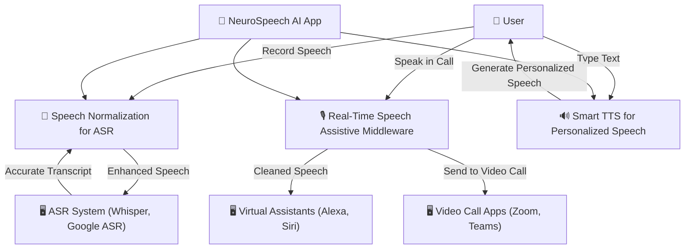

```mermaid
%% AI-Powered Speech Accessibility App - Use Case Diagram
graph TD

    %% Actors
    User["👤 User"]

    %% System
    SpeechApp["📲 NeuroSpeech AI App"]

    %% Use Cases
    SpeechNormalization["🎤 Speech Normalization for ASR"]
    AssistiveMiddleware["🎙️ Real-Time Speech Assistive Middleware"]
    SmartTTS["🔊 Smart TTS for Personalized Speech"]

    %% External Services
    ASR["🖥️ ASR System (Whisper, Google ASR)"]
    VirtualAssistant["🖥️ Virtual Assistants (Alexa, Siri)"]
    VideoCall["🖥️ Video Call Apps (Zoom, Teams)"]

    %% User Interactions
    User -->|Record Speech| SpeechNormalization
    User -->|Speak in Call| AssistiveMiddleware
    User -->|Type Text| SmartTTS

    %% System Processing
    SpeechApp --> SpeechNormalization
    SpeechApp --> AssistiveMiddleware
    SpeechApp --> SmartTTS

    %% External Services Integration
    SpeechNormalization -->|Enhanced Speech| ASR
    ASR -->|Accurate Transcript| SpeechNormalization

    AssistiveMiddleware -->|Cleaned Speech| VirtualAssistant
    AssistiveMiddleware -->|Send to Video Call| VideoCall

    SmartTTS -->|Generate Personalized Speech| User
```
